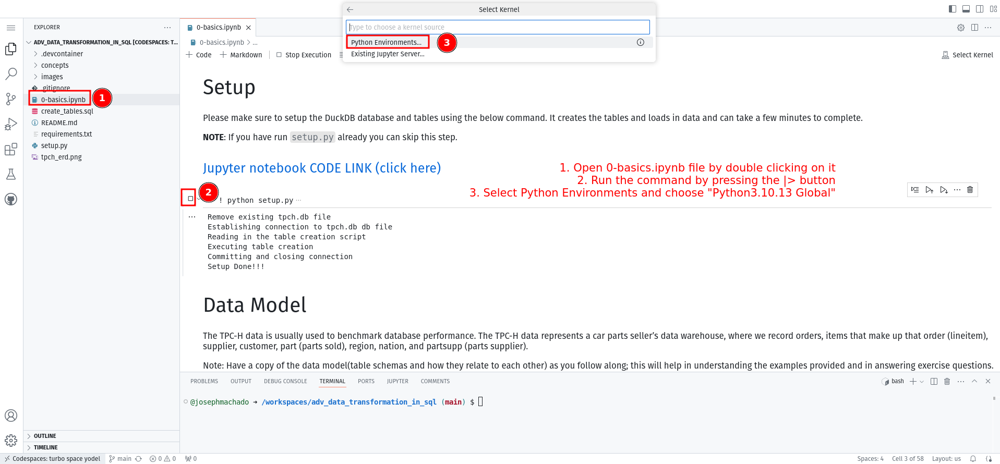

* [Data Engineering Interview Series Posts](#data-engineering-interview-series-posts)
* [Prerequisites](#prerequisites)
* [Setup](#setup)
    * [Option 1: Github codespaces (Recommended)](#option-1-github-codespaces-recommended)
    * [Option 2: Run locally](#option-2-run-locally)

This is a repo that contains all the code for my **"Data Engineering Interview Series"**.

## Data Engineering Interview Series Posts 

1. [Data Engineering Interview Series #1: Data Structures and Algorithms](https://www.startdataengineering.com/post/de_interview_dsa/)

## Prerequisites

1. Sign up for a Github account.

## Setup

You have two options to run the exercises in this repo

### Option 1: Github codespaces (Recommended)

Steps:

1. Create [Github codespaces with this link](https://github.com/codespaces/new?skip_quickstart=true&machine=basicLinux32gb&repo=841408842&ref=main&geo=UsEast).
2. Now open the [./DSA/dsa_prep.ipynb](./DSA/dsa_prep.ipynb) (or any ipynb) and it will open in a Jupyter notebook interface. You will be asked for your kernel choice, choose `Python Environments` and then `python3.10.13 Global`.
        

### Option 2: Run locally

Steps:

1. Clone this repo, cd into the cloned repo
2. Start a virtual env and install requirements.
3. Start Jupyter lab and run the `ipynb` notebooks.

```bash
git clone https://github.com/josephmachado/data-engineering-interview-series.git
cd data-engineering-interview-series
python -m venv ./env # create a virtual env
source env/bin/activate # use virtual environment
pip install -r requirements.txt
jupyter lab
```


